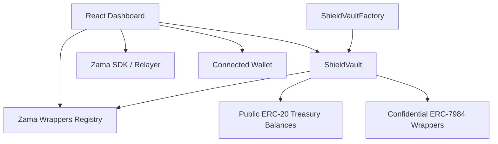

# ShieldVault

ShieldVault is a confidential DAO treasury manager built on the Zama wrappers ecosystem. The workspace contains two packages:

- [shieldvault-contracts](shieldvault-contracts) for the Hardhat smart contracts, tests, and deployment scripts.
- [shieldvault-frontend](shieldvault-frontend) for the Vite + React dashboard that talks to the deployed vault and registry.

The core idea is simple: a DAO can hold normal ERC-20 treasury balances, wrap supported assets into confidential ERC-7984 tokens, and send private payments to contributors while keeping amounts hidden on-chain.

## What ShieldVault Does

ShieldVault is designed around three goals:

1. Hold public ERC-20 treasury balances in a vault contract.
2. Convert supported tokens into confidential wrappers from the official Zama Wrappers Registry.
3. Pay registered contributors without revealing the transferred amount on-chain.

The on-chain system is split between a factory and per-DAO vaults:

- The factory deploys one `ShieldVault` per DAO and tracks the vault addresses.
- Each vault stores its own admin, contributor list, and token balances.
- The vault validates confidential wrappers against the official registry every time it wraps or uses a wrapper.

## Repository Layout

```text
shieldvault/
├── README.md
├── shieldvault-contracts/
│   ├── contracts/
│   ├── deploy/
│   ├── test/
│   ├── artifacts/
│   └── typechain-types/
└── shieldvault-frontend/
		├── src/
		│   ├── components/
		│   ├── config/
		│   ├── hooks/
		│   ├── pages/
		│   └── styles/
		└── package.json
```

## Architecture



## Deployed Contracts (Sepolia)

Wrappers Registry: 0x2f0750Bbb0A246059d80e94c454586a7F27a128e

ShieldVaultFactory: 0x6AF19cF8dCb588DCc239726e87881B8AfbF0F1b2

ShieldVault: 0x430d43d293de91a008Cc48dB6116b5CAca687077

The repository is Sepolia-first. The frontend configuration, wallet connection, RPC defaults, and relayer defaults all target Sepolia unless you override them in environment variables.

## Smart Contract Package

The contracts package lives in [shieldvault-contracts](shieldvault-contracts) and is built with Hardhat, TypeScript, OpenZeppelin, and the Zama FHE libraries.

### Main Contracts

- [contracts/ShieldVault.sol](shieldvault-contracts/contracts/ShieldVault.sol) is the treasury contract.
- [contracts/ShieldVaultFactory.sol](shieldvault-contracts/contracts/ShieldVaultFactory.sol) deploys vault instances.
- [contracts/interfaces/IConfidentialTokenWrappersRegistry.sol](shieldvault-contracts/contracts/interfaces/IConfidentialTokenWrappersRegistry.sol) defines the registry read API.
- [contracts/interfaces/IERC7984ConfidentialToken.sol](shieldvault-contracts/contracts/interfaces/IERC7984ConfidentialToken.sol) defines the confidential token interface.
- [contracts/test/Mocks.sol](shieldvault-contracts/contracts/test/Mocks.sol) provides test-only mock contracts.

### ShieldVault Behavior

The vault contract supports these behaviors:

- ERC-20 deposits from any address.
- Admin-only ERC-20 withdrawals.
- ERC-20 to confidential token wrapping.
- Confidential token unwrapping.
- Contributor registration and removal.
- Two-step admin transfer.
- Registry helper reads for the frontend.

Important contract-level security and privacy choices:

- Every wrap is validated against the official registry before tokens move.
- Revoked wrappers are rejected.
- Payment events omit transfer amounts so amounts are not exposed in logs.
- Admin transfer is two-step, with an explicit accept step.
- Reentrancy protection is enabled on the mutating treasury operations.

### Factory Behavior

The factory deploys a fresh vault for a given admin address and stores the deployed address in on-chain tracking arrays. The factory itself never holds treasury funds.

### Tests

The contract test suite is in [test/ShieldVault.test.ts](shieldvault-contracts/test/ShieldVault.test.ts).

The tests cover:

- Factory and vault deployment wiring.
- Admin access control.
- Contributor add/remove flows.
- ERC-20 deposits and withdrawals.
- Registry validation failure cases.
- Two-step admin transfer.

These tests use local mock contracts rather than live Sepolia FHEVM infrastructure.

### Contract Package Scripts

From [shieldvault-contracts/package.json](shieldvault-contracts/package.json):

- `npm run compile` compiles the contracts.
- `npm run test` runs the local Hardhat test suite.
- `npm run test:sepolia` runs the test suite against Sepolia.
- `npm run deploy:sepolia` deploys the factory and initial vault to Sepolia.
- `npm run verify` runs contract verification on Sepolia.

## Frontend Package

The frontend lives in [shieldvault-frontend](shieldvault-frontend) and is a Vite + React application that uses wagmi, viem, React Query, and the Zama SDK.

### App Structure

- [src/App.tsx](shieldvault-frontend/src/App.tsx) gates the UI behind wallet connection and handles page switching.
- [src/main.tsx](shieldvault-frontend/src/main.tsx) wires Wagmi and React Query providers.
- [src/components/Shell.tsx](shieldvault-frontend/src/components/Shell.tsx) provides the app shell, navigation, vault address display, and Etherscan link.
- [src/components/ConnectPage.tsx](shieldvault-frontend/src/components/ConnectPage.tsx) is the landing screen shown before wallet connection.

### Pages

The app exposes five main pages:

- Dashboard: treasury summary, registry summary, balance overview, and client-side decrypt flow for the connected wallet’s own confidential balance.
- Wrap Station: token deposit and wrap workflows, registry validation, and quick token selection.
- Contributors: contributor roster and admin-only add/remove flows.
- Pay: confidential payment flow for the vault admin using the Zama SDK.
- Registry: registry pair explorer and explanation of valid versus revoked wrappers.

### Frontend Data Flow

The frontend reads contract state through wagmi and uses local ABI fragments and address constants from [src/config/contracts.ts](shieldvault-frontend/src/config/contracts.ts).

Key frontend constants and helpers include:

- `ADDRESSES` for deployed contract addresses and relayer URL.
- `REGISTRY_ABI`, `VAULT_ABI`, and `ERC20_ABI` for on-chain reads and writes.
- `TOKEN_LABELS` and `ERC20_LABELS` for known Sepolia token metadata.
- `RESTRICTED_MINT_TOKENS` for Sepolia assets that cannot be publicly minted in the UI.

The network config in [src/config/wagmi.ts](shieldvault-frontend/src/config/wagmi.ts) targets Sepolia only.

### Zama SDK Integration

The Zama integration lives in [src/hooks/useZamaSDK.ts](shieldvault-frontend/src/hooks/useZamaSDK.ts).

The hook builds a `ZamaSDK` instance from the connected wallet client and Sepolia public client, then uses the Sepolia relayer for confidential operations. The frontend currently uses this SDK directly for wallet-to-wallet confidential transfers and client-side balance decryption.

### Important Frontend Caveat

The payment page does not call the vault contract’s `payContributor` method today. Instead, it sends confidential transfers directly from the connected wallet with the Zama SDK.

That means:

- The contributor list acts as the UI roster for recipients.
- The on-chain vault contributor registry is still useful for administration and display.
- The current payment UX is a client-side confidential transfer flow, not a vault-disbursed payroll flow.

If you are documenting or extending the product, this is the most important behavior to keep in mind.

## Deployment Flow

Deployment is a two-step process in the contracts package:

1. `01_deploy_factory.ts` deploys `ShieldVaultFactory` with the registry address for the target network.
2. `02_deploy_vault.ts` calls the factory to deploy the first vault and prints the frontend environment values.

The second script is the handoff point between the on-chain deployment and the frontend. It prints:

- `VITE_FACTORY_ADDRESS`
- `VITE_VAULT_ADDRESS`
- `VITE_NETWORK=sepolia`

Copy those values into the frontend environment file before starting the UI.

## Environment Variables

### Contracts

The contracts package expects these variables:

- `SEPOLIA_RPC_URL`
- `PRIVATE_KEY`
- `REGISTRY_ADDRESS_SEPOLIA`
- `VAULT_ADMIN_ADDRESS` optional, used by the initial vault deploy script
- `ETHERSCAN_API_KEY` optional, used for verification
- `REGISTRY_ADDRESS_LOCAL` optional, used for local Hardhat deployments

### Frontend

The frontend expects these variables:

- `VITE_FACTORY_ADDRESS`
- `VITE_VAULT_ADDRESS`
- `VITE_REGISTRY_ADDRESS`
- `VITE_SEPOLIA_RPC_URL`
- `VITE_RELAYER_URL`
- `VITE_WALLETCONNECT_PROJECT_ID` optional

The code also provides Sepolia fallback values, but setting the environment variables explicitly is the recommended setup.

## Local Setup

### 1. Install Dependencies

Install dependencies in both packages:

```bash
cd shieldvault-contracts
npm install

cd ../shieldvault-frontend
npm install
```

### 2. Configure the Contracts Package

Copy [shieldvault-contracts/.env.example](shieldvault-contracts/.env.example) to `.env` and fill in the Sepolia deployment values required by the deployment scripts.

At minimum, set the registry address for the network you want to deploy to.

### 3. Deploy the Contracts

Run the Sepolia deployment scripts from [shieldvault-contracts](shieldvault-contracts):

```bash
npm run deploy:sepolia
```

The deployment output gives you the factory and vault addresses needed by the frontend.

### 4. Configure the Frontend

Copy [shieldvault-frontend/.env.example](shieldvault-frontend/.env.example) to `.env` and set the addresses printed during deployment.

### 5. Start the UI

Run the frontend in development mode:

```bash
cd shieldvault-frontend
npm run dev
```

## User Flows

### Connect Wallet

Users connect with an injected wallet such as MetaMask or WalletConnect. The app only runs on Sepolia.

### Dashboard

The dashboard shows:

- Valid and revoked registry wrapper counts.
- Contributor count.
- Public ERC-20 holdings in the vault.
- Confidential wrapper inventory.
- Vault metadata.
- A client-side decrypt flow for the connected user’s own confidential balance.

### Wrap Station

The Wrap Station supports two modes:

- Deposit ERC-20 into the vault.
- Wrap supported ERC-20 into confidential wrappers.

Before wrapping, the UI queries the registry and blocks revoked or unregistered wrappers. For deposits, the UI can also prompt for ERC-20 approval when needed.

### Contributors

Admins can add and remove contributors, assign labels, and review the contributor roster. Non-admin users only get read-only access.

### Pay

The payment page lets the vault admin select a contributor, choose a valid confidential token, and send an encrypted transfer with the Zama SDK.

### Registry

The registry page lists every token-wrapper pair, splits valid and revoked entries, and explains how ShieldVault uses the registry as the source of truth.

## Security Audit

A full adversarial review was run against the contracts and frontend. Findings below, grouped by severity.

**Critical**

Payment flow does not route through vault access control.

The frontend sends confidential transfers wallet to wallet through the Zama SDK. The vault's `payContributor` function enforces admin and contributor checks, but the current UI never calls it.

Anyone holding confidential tokens can send to any address, contributor or not. The transfer never touches the vault, so the access control written into the contract provides no protection for payments as currently shipped.

This is a deliberate architecture choice, not an oversight. Building a version where the vault holds custody of confidential balances and routes payments through `payContributor` requires a different flow for how tokens get wrapped and held. `payContributor` stays in the contract as the intended enforcement path for a future version.

**High**

Single admin, no timelock.

One private key controls the entire vault. No multisig requirement. No delay on admin transfer. No pause mechanism if that key gets compromised.

A production version needs a multisig admin and a timelock on `transferAdmin`.

Arbitrary wrap recipient.

`wrapToken` accepts any recipient address as a parameter. An admin could wrap vault funds and send the resulting confidential tokens to a personal wallet instead of keeping them in the vault.

The frontend mitigates this. The Wrap Station always passes the connected wallet's own address as recipient. The contract itself still allows any address, so this remains a trust assumption on the admin.

**Medium**

Approve without reset.

`wrapToken` calls approve directly with the new amount, without setting the allowance to zero first. Some ERC-20 implementations require a reset to zero before changing a nonzero allowance, and revert otherwise.

Not an issue for the mock tokens in this deployment. Worth checking before integrating tokens that enforce this pattern.

18 decimal overflow guard.

FHE encrypted integers max out at uint64, which caps around 18.44 tokens for an 18 decimal asset. The Pay page checks for this before encrypting. Wrap Station now carries the same check, showing the maximum allowed amount for the selected token before submission.

**Low**

Registry pagination.

`getTokenConfidentialTokenPairs` returns the full array in one call. Fine at the current registry size. Reads get more expensive as the registry grows into the hundreds of entries.

Public mint on testnet tokens.

The mock ERC-20 tokens expose an open mint function, limited to 1,000,000 tokens per call. Expected testnet behavior, not a production assumption. Tokens with restricted minting are flagged separately in the UI and excluded from the built-in mint button.

## Known Limitations

- The frontend is Sepolia-specific today.
- The payment page uses direct Zama SDK confidential transfers instead of the vault contract’s `payContributor` method.
- Contract tests use mocks rather than a live Sepolia FHEVM stack.
- The deployment flow requires copying printed addresses into the frontend env file manually.
- The repo does not currently provide a single top-level automation script that installs, deploys, and configures both packages in one step.
- Unwrap finalization is asynchronous. Unwrap runs in two on-chain steps. Step one calls unshield. Your confidential tokens burn. The wrapper contract emits an UnwrapRequested event with a unique request ID. Step two happens off-chain first. A relayer generates a decryption proof for the requested amount. Someone then submits that proof on-chain through finalizeUnwrap. Only after this second step completes does your ERC-20 balance actually update. Step one works. The UnwrapRequested event fired on Sepolia with your wallet as receiver. The transaction confirmed in MetaMask.
The SDK's built-in receipt check does not always detect this second step in the current beta release. This can surface a misleading error message even when the request itself succeeded on-chain. For this build, unwrap requests submit correctly and verifiably on-chain. Full automatic finalization through the SDK depends on relayer timing that sits outside application code.

## References

- Contracts package: [shieldvault-contracts](shieldvault-contracts)
- Frontend package: [shieldvault-frontend](shieldvault-frontend)
- Core vault contract: [shieldvault-contracts/contracts/ShieldVault.sol](shieldvault-contracts/contracts/ShieldVault.sol)
- Factory contract: [shieldvault-contracts/contracts/ShieldVaultFactory.sol](shieldvault-contracts/contracts/ShieldVaultFactory.sol)
- Frontend config: [shieldvault-frontend/src/config/contracts.ts](shieldvault-frontend/src/config/contracts.ts)
- Zama SDK hook: [shieldvault-frontend/src/hooks/useZamaSDK.ts](shieldvault-frontend/src/hooks/useZamaSDK.ts)

## Suggested Next Steps

1. Add a small top-level automation script or workspace task for install and startup.
2. Align the Pay page with the vault contract’s `payContributor` path if on-chain payroll enforcement is the desired production flow.
